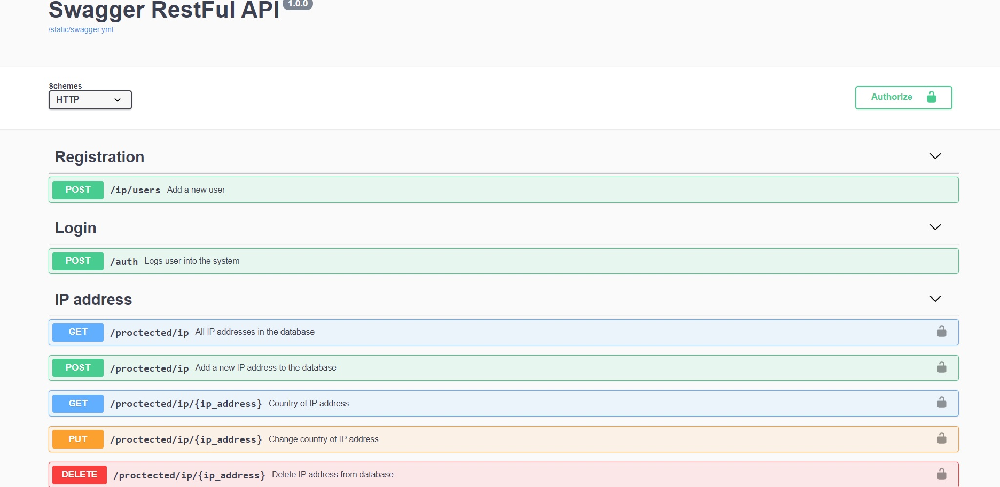

## **Flask-RESTful API**

### Installation
``
pip install requirement.txt
``

### Running apllication
Open Terminal in project path and use below commands

```
$ flask run
```
### Swagger
http://127.0.0.1:5000/swagger



## Technologies
Python 3.9

